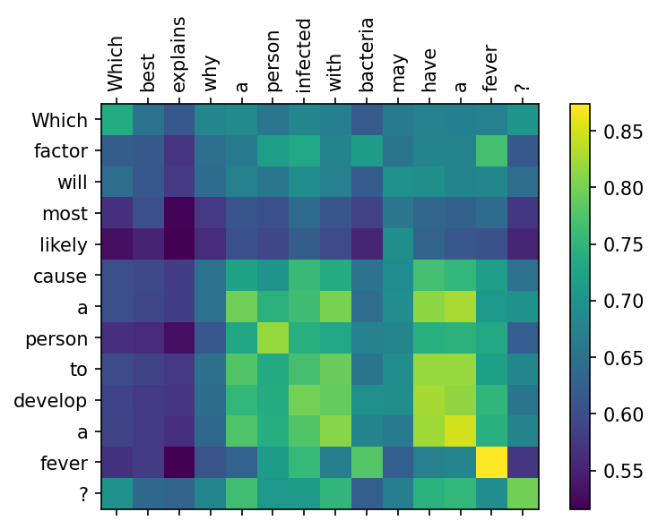

## Interpreting Semantic Text Similarity 

In this demo, I test out a very simple approach to get a glimpse into context similarities picked up by the models when doing contextual search with simple vector math. For the purpose of this demo, I will be using a model from the sentence transformers library which has specifically been optimized for doing semantic textual similarity searches. The model creates 1024-dimensional embedding for each sentence passed to it, and the similarity between two such sentences can then be calculated by the cosine similarity between the corresponding two vectors.

## Sentence Transformers Library
[Sentence Transformers](https://github.com/UKPLab/sentence-transformers)

## Dataset

For the purpose of this demo, I embedded a set of 1700 questios from the ARCquestion classification dataset.

## Link to the Dataset
[ARC Question Classification Dataset](https://allenai.org/data/arc-classification)

## Sentence Embeddings

With the help of sentence embeddings we can easily perform searches in our database of questions, lets say we've a database of 1700 questions, which we've embedded into a 1700 by 1024 matrix. The first step would be to L2 normalize each row, meaning we normalize each question vector to have a length of 1, such that the cosine similarity between A and B is simply the dot product of the two vectors. We can pretend that the first question in our dataset is our query, and try to find the closest matching entry from the rest of the questions.

## Perform Search & Show Search Context

In the sample dataset, the first question (query) was "Which factor will most likely cause a person to develop a fever?" and the identified similar question was "Which best explains why a person infected with bacteria may have a fever?". Seems like a pretty good match - both sentences relate to person developing fever. But, how do we know that the alogrithm did not choose that specific match just because they both start with word "Which"?

By design the transformer models output a 1024-dimensional vector for each token in our sentences - these token embeddings are mean-pooled to generate our sentence embeddings. As such, to get more information on the context used for finding the match in our search query, we could calculate the cosine distance between each token in our query and search match.

It is clear from the plot above that indeed the "fever" keyword is picked up and is a major part of the "semantic context" which resulted in the search result -- however, there are additional components entering into the semantic context, like, "to develop a" and "have a" combine with a high cosine similarity score and the keyword "person" is also picked up, while the initial word "which", present in both the sentences is less important.

> Hence the simple technique of calculating the cosine similarity between all token embeddings gives insight into the contributions of each token towards the final similarity score, and is thus a quick way of explaining what the model is doing when it returns a given search result.
